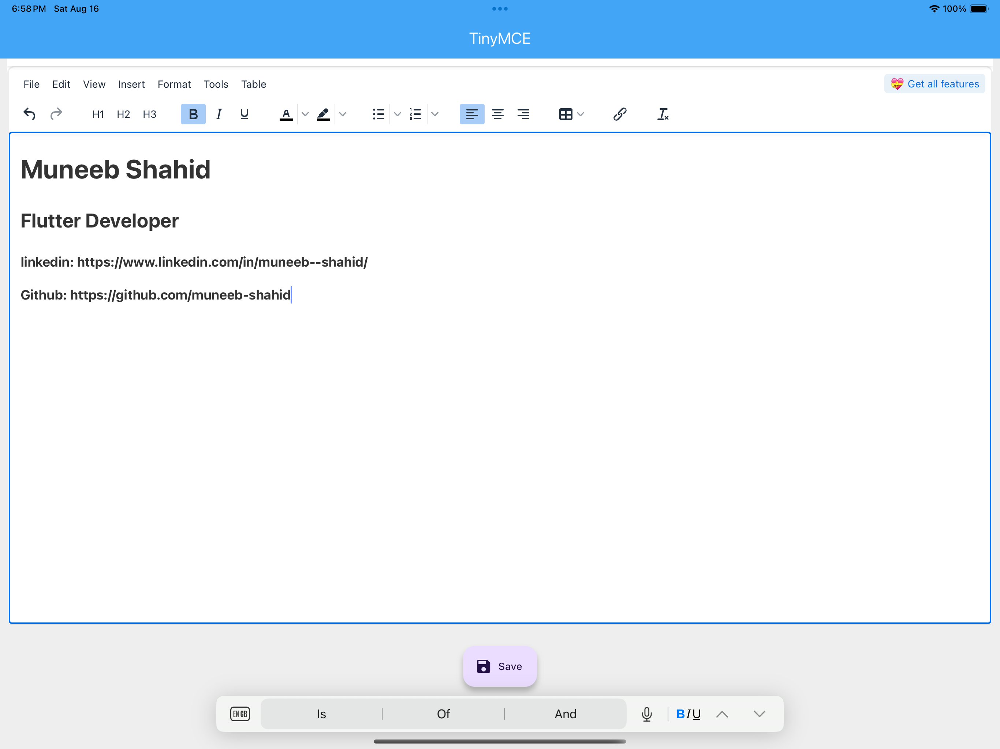
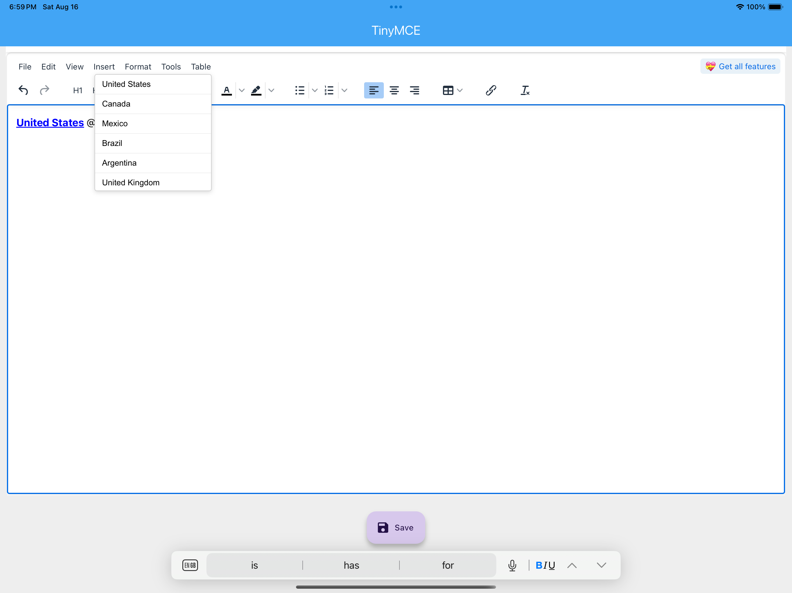
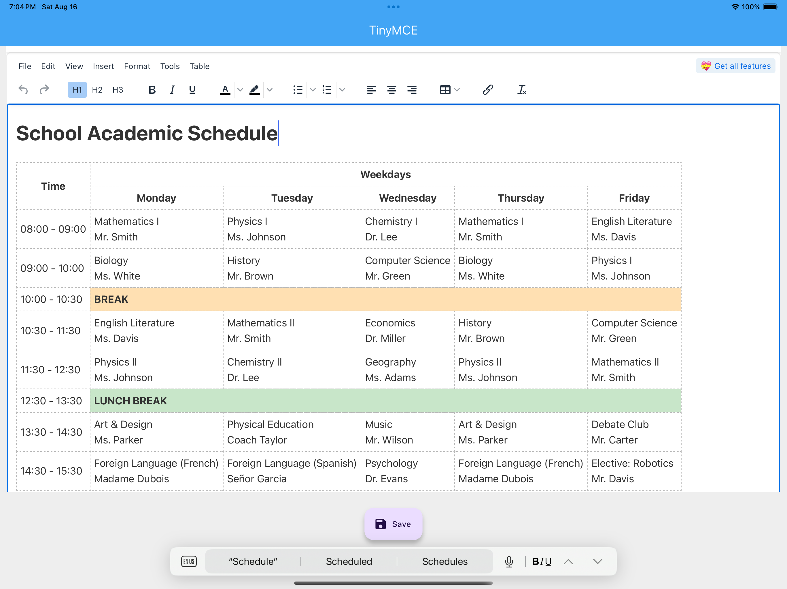

<!DOCTYPE html>
<html lang="en">
<head>
  <meta charset="UTF-8">
  
</head>
<body>
<!--   title>TinyMCE-Editor • Flutter WYSIWYG via WebView</title> -->
  <h1 align="center">TinyMCE-Editor • Flutter WYSIWYG via WebView</h1>
  

    <b>A Flutter application integrating the TinyMCE rich-text editor in a WebView, featuring dynamic @mention autocomplete.</b>
  

  

    <a href="https://github.com/muneeb-shahid/TinyMCE-Editor">
      Visit the repository on GitHub
    </a>
  

  

  <h2>Introduction</h2>
  

    TinyMCE-Editor demonstrates how to embed the powerful <a href="https://www.tiny.cloud/">TinyMCE</a> editor inside a Flutter app using <code>webview_flutter</code>. A standout feature is the dynamic <code>@mention</code> system—suggestions are supplied by Flutter, filtered live in TinyMCE, and inserted as clickable, metadata-enriched links.
  

  <h2>Features</h2>
  <ul>
    <li><strong>Embedded Rich Text Editing</strong> via TinyMCE within Flutter.</li>
    <li><strong>Smart @mention Autocomplete</strong>: filterable suggestion dropdown with metadata.</li>
    <li><strong>Platform-Specific Asset Handling</strong>: tailored for Android and iOS file paths.</li>
    <li><strong>Custom Toolbar</strong>: includes formatting tools, lists, tables, links, and alignment.</li>
    <li><strong>Two-Way Communication</strong> between Flutter and TinyMCE via JS channel.</li>
    <li><strong>Content Save Functionality</strong> through Flutter’s UI.</li>
  </ul>

  <h2>Project Structure</h2>
  <pre>
lib/
 ├── main.dart        # Application entry point
 ├── tinymcview.dart  # WebView and TinyMCE integration logic
assets/editor/
 ├── editor.html      # HTML + JavaScript for TinyMCE and @mention logic
 ├── tinymce/         # Core TinyMCE assets: JS, skins, themes, plugins
  </pre>

  <h2>Setup & Usage</h2>
  <h3>1. Clone the repository</h3>
  <pre><code>git clone https://github.com/muneeb-shahid/TinyMCE-Editor.git
cd TinyMCE-Editor</code></pre>

  <h3>2. Install dependencies</h3>
  <pre><code>flutter pub get</code></pre>

  <h3>3. Run the app</h3>
  <pre><code>flutter run</code></pre>

  <h2>Screenshots</h2>
  

    <!-- Update paths once you add screenshots -->
    
    
    
  

  <h2>How It Works</h2>
  <ol>
    <li><strong>Initialization:</strong> Flutter loads <code>editor.html</code> inside a WebView.</li>
    <li><strong>Injection:</strong> Flutter passes suggestion data via <code>initializeSuggestions()</code>.</li>
    <li><strong>Mention Trigger:</strong> Typing <code>@</code> opens a filtered dropdown from suggestions.</li>
    <li><strong>Insertion:</strong> Selecting an item inserts a hyperlink with <code>data-id</code> metadata.</li>
    <li><strong>Communication:</strong> TinyMCE notifies Flutter of content changes via the <code>FlutterEditor</code> channel.</li>
    <li><strong>Saving:</strong> Flutter retrieves HTML content using TinyMCE’s <code>getContent()</code> method.</li>
  </ol>

  <h2>Dependencies</h2>
  <ul>
    <li><a href="https://pub.dev/packages/flutter">flutter</a></li>
    <li><a href="https://pub.dev/packages/webview_flutter">webview_flutter</a></li>
    <li><a href="https://pub.dev/packages/cupertino_icons">cupertino_icons</a></li>
  </ul>

  <h2>Use Cases</h2>
  <ul>
    <li>Content Management Systems (CMS)</li>
    <li>In-app Chat/Messaging with mentions</li>
    <li>Note-taking or Documentation Tools</li>
    <li>Enterprise Collaboration Platforms</li>
  </ul>

  <h2>Contributing</h2>
  <ol>
    <li>Fork the repository.</li>
    <li>Create a new branch: <code>git checkout -b feature/new-feature</code>.</li>
    <li>Commit your changes: <code>git commit -m "Add awesome feature"</code>.</li>
    <li>Push to your branch: <code>git push origin feature/new-feature</code>.</li>
    <li>Open a Pull Request. ⭐</li>
  </ol>

  <h2>License</h2>
  

    Licensed under the [MIT License](LICENSE). Feel free to use, adapt, and contribute!
  

  <h2>Acknowledgements</h2>
  <ul>
    <li><a href="https://www.tiny.cloud/">TinyMCE Editor</a></li>
    <li><a href="https://flutter.dev/">Flutter Framework</a></li>
  </ul>
</body>
</html>
